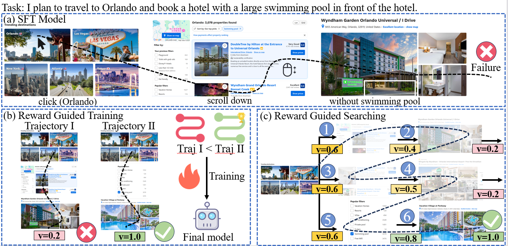

# Agent-RewardBench


## 📄 Paper

*Agent-RewardBench: Towards a Unified Benchmark for Reward Modeling across Perception, Planning, and Safety in Real-World Multimodal Agents*


<p>
  
</p>

**Agent-RewardBench** is a  benchmark designed to evaluate reward modeling in real-world multimodal agent scenarios. It covers three critical dimensions:

- **Perception**
- **Planning**
- **Safety**

## 📦 Dataset Access

**Agent-RewardBench** is available on Hugging Face Datasets: [Agent-RewardBench](https://huggingface.co/datasets/MultimodalAgent/Agent-RewardBench)

To load the dataset, use the following code:

```python
from datasets import load_dataset

dataset = load_dataset("MultimodalAgent/Agent-RewardBench")